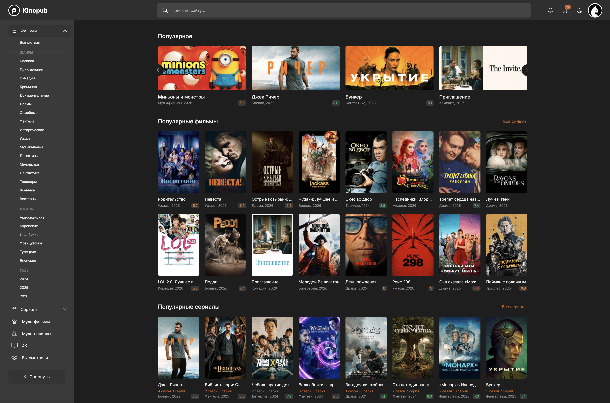

<p align="center">
  
</p>

<h1 align="center">Кинопаб</h1>

<p align="center">
  Удобный клиент Kinopub для Windows, Android и Android TV.
</p>

<p align="center">
  
</p>

## Скачать

| Платформа | Скачать |
|----------|---------|
| Windows | [Kinopub-Setup-0.0.1.exe](https://github.com/kinopub-app/app/releases/download/v1.0/kinopub-Setup-0.0.1.exe) |
| Android | [Kinopub-android-1.0.1.apk](https://github.com/kinopub-app/app/releases/download/v1.0/kinopub-android-1.0.1.apk) |
| Android TV | [Kinopub-android-tv-0.0.1.apk](https://github.com/kinopub-app/app/releases/download/v1.0./kinopub-android-tv-0.0.1.apk) |
| Web | [kinopub.my](https://kinopub.my/) |

Все версии и checksums доступны в [Releases](https://github.com/kinopub-app/app/releases).

## Возможности

- Windows-приложение с быстрым запуском и автообновлениями.
- APK для Android-смартфонов.
- Отдельная сборка для Android TV и управления с пульта.
- Веб-версия для быстрого входа без установки.
- Release notes и checksums для каждой версии.

## Android через Obtainium

Можно добавить приложение в [Obtainium](https://github.com/ImranR98/Obtainium), чтобы получать уведомления о новых APK.

URL репозитория:

```text
https://github.com/kinopub-app/app
```


## FAQ

**Где скачать последнюю версию?**  
В разделе [Releases](https://github.com/kinopub-app/app/releases/).

**Есть версия для Android TV?**  
Да, используйте файл `kinopub-android-tv-*.apk`.

**Можно ли пользоваться без установки?**  
Да, откройте [веб-версию](https://kinopub.my/).

## SEO

kinopub.my — приложение для Windows, Android и Android TV: удобный клиент, APK-релизы, Android TV build, веб-версия, обновления через GitHub Releases.
